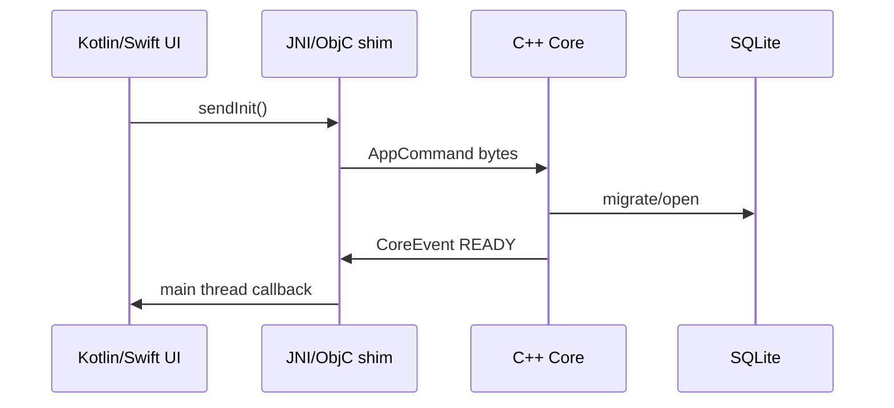

# C++ Core ↔ Mobile App — IDL, Bridge & Data Layer

Tài liệu cho role **Core C++** kết nối **Android (Java/Kotlin)** và **iOS (Swift)** — IDL, serialization, FFI/JNI, database, ví dụ code và Q&A phỏng vấn.

**Ví dụ trong repo:** [examples/mobile_bridge/](examples/mobile_bridge/) (`bridge.proto`, C++ header sketch)

**Liên quan:** [ipc_concepts.md](ipc_concepts.md) §8 Protobuf · [database_management.md](database_management.md) · [networking.md](networking.md)

---

## 1. Kiến trúc tổng quan

```
┌─────────────────────────────────────────────────────────────────┐
│                     Mobile App (UI layer)                        │
│   Android: Kotlin/Java          iOS: Swift / SwiftUI             │
└────────────────────────────┬────────────────────────────────────┘
                             │ Bridge (JNI / ObjC++ / C API)
┌────────────────────────────▼────────────────────────────────────┐
│              Thin platform shim (không business logic nặng)      │
│   - Marshal bytes, thread attach, lifecycle, callbacks           │
└────────────────────────────┬────────────────────────────────────┘
                             │ IDL messages (Protobuf / FlatBuffers / JSON)
┌────────────────────────────▼────────────────────────────────────┐
│                    C++ Core (engine / SDK)                       │
│   - Real-time, crypto, media, sync, protocol, threading        │
│   - Optional: SQLite / network client → backend DB               │
└────────────────────────────┬────────────────────────────────────┘
                             │
              ┌──────────────┼──────────────┐
              ▼              ▼              ▼
         Local SQLite    HTTP/gRPC      File cache
         (on device)     (cloud API)    (mmap / disk)
```

### Tách trách nhiệm (senior expectation)

| Layer | Làm gì | Không làm gì |
|-------|--------|--------------|
| **C++ core** | Logic nặng, thread pool, state machine, wire format | Touch UI, Activity lifecycle trực tiếp |
| **Bridge** | Convert bytes ↔ language types, dispatch callback thread | Duplicate business rules |
| **App** | UX, permissions, background policy, navigation | Parse binary protocol phức tạp trên main thread |

---

## 2. IDL là gì? Chọn gì cho mobile bridge?

**IDL (Interface Definition Language)** — mô tả **contract** giữa core và app: message types, field IDs, versioning — sinh code đa ngôn ngữ.

| IDL / format | Codegen | Wire | Versioning | Mobile ecosystem |
|--------------|---------|------|------------|------------------|
| **Protocol Buffers** | `protoc` → C++, Java, ObjC, Swift* | Binary compact | Field numbers, `reserved` | **Chuẩn industry** — gRPC, Firebase, nhiều SDK |
| **FlatBuffers** | `flatc` | Binary, read without parse | Schema evolution | Game, performance-critical |
| **Cap'n Proto** | `capnp` | Zero-copy read | Strong | Ít phổ biến mobile |
| **JSON Schema + JSON** | OpenAPI / hand-written | Text, lớn | Schema version field | Debug dễ, prototype |
| **Custom binary** | Hand-maintained | Tối ưu nhất | Khó | Chỉ khi team rất giàu kinh nghiệm |

\* Swift: **SwiftProtobuf** (plugin `protoc-gen-swift`) hoặc ObjC generated + bridge.

### Khuyến nghị phỏng vấn / production

1. **Mặc định: Protobuf 3** — một file `bridge.proto`, generate C++ + Kotlin + Swift.  
2. **Hot path cực nhanh (game, frame buffer):** FlatBuffers hoặc shared memory + fixed header.  
3. **Debug / feature flag:** JSON overlay cho logging, không thay wire chính.

### Transport trên mobile (không nhầm với IDL)

| Pattern | Khi nào |
|---------|---------|
| **In-process FFI** | `.so` (Android) / `.xcframework` (iOS) — **phổ biến nhất** |
| **Local socket / pipe** | Process tách (sandbox), ít gặp trên consumer app |
| **HTTP/gRPC** | Core gọi cloud; app không parse — core expose status qua IDL |

---

## 3. Contract design — `bridge.proto` pattern

Xem file mẫu: [examples/mobile_bridge/bridge.proto](examples/mobile_bridge/bridge.proto)

### Hướng message

```
App  ──AppCommand──▶  Core
App  ◀──CoreEvent────  Core
```

- **Command:** intent từ UI (init, start, config)  
- **Event:** async notification (ready, progress, error, data chunk)  
- **`request_id`:** correlate response/event với command  

### Framing (bắt buộc trên byte stream)

```
[uint32 length big-endian][protobuf payload]
```

Một số team thêm `magic (4B) + version (1B)` trước length để detect corrupt stream.

### Versioning

```protobuf
message AppCommand {
  int32 api_version = 99;  // optional explicit API level
  // ...
}
```

- Chỉ **thêm** field mới trong proto3  
- `reserved` field đã xóa  
- App cũ + core mới: core bỏ qua unknown fields  

---

## 4. C++ core — implement

### 4.1 Generate & build

```bash
protoc --cpp_out=./gen/cpp examples/mobile_bridge/bridge.proto
```

```cmake
find_package(Protobuf REQUIRED)
protobuf_generate_cpp(PROTO_SRCS PROTO_HDRS ${CMAKE_CURRENT_SOURCE_DIR}/../examples/mobile_bridge/bridge.proto)
add_library(bridge_proto ${PROTO_SRCS} ${PROTO_HDRS})
target_link_libraries(bridge_proto PUBLIC protobuf::libprotobuf)

add_library(core SHARED core_impl.cpp)
target_link_libraries(core PRIVATE bridge_proto)
# Android: ndk-build or CMake with ANDROID_ABI
# iOS: CMAKE_OSX_ARCHITECTURES "arm64"
```

### 4.2 Core handler (example)

```cpp
#include "bridge.pb.h"
#include <vector>

namespace myapp::bridge {

void CoreBridge::handle_command(const uint8_t* data, size_t len) {
    myapp::bridge::AppCommand cmd;
    if (!cmd.ParseFromArray(data, len))
        return;  // or emit ErrorEvent INVALID_PAYLOAD

    switch (cmd.type()) {
    case myapp::bridge::COMMAND_TYPE_INIT:
        emit_ready(cmd.request_id());
        break;
    case myapp::bridge::COMMAND_TYPE_SYNC_CONFIG:
        // apply cmd.sync_cfg() ...
        break;
    default:
        break;
    }
}

void CoreBridge::emit_ready(uint64_t request_id) {
    myapp::bridge::CoreEvent ev;
    ev.set_request_id(request_id);
    ev.set_type(myapp::bridge::EVENT_TYPE_READY);
    ev.mutable_ready()->set_core_version("1.2.0");

    std::string bytes;
    ev.SerializeToString(&bytes);
    if (on_event_)
        on_event_({bytes.begin(), bytes.end()});
}

std::vector<uint8_t> CoreBridge::frame_message(const std::vector<uint8_t>& payload) {
    uint32_t len = htonl(static_cast<uint32_t>(payload.size()));
    std::vector<uint8_t> out(4 + payload.size());
    memcpy(out.data(), &len, 4);
    memcpy(out.data() + 4, payload.data(), payload.size());
    return out;
}

}  // namespace myapp::bridge
```

### 4.3 C API ổn định cho cả JNI và Swift (khuyến nghị)

Export **C ABI** từ `.so` / `.xcframework` — JNI/ObjC++ chỉ wrap C API, tránh name mangling C++ qua boundary.

```cpp
// core_c_api.h
#pragma once
#include <stddef.h>
#include <stdint.h>

#ifdef __ANDROID__
#define CORE_API __attribute__((visibility("default")))
#elif defined(__APPLE__)
#define CORE_API __attribute__((visibility("default")))
#else
#define CORE_API
#endif

extern "C" {

typedef void (*core_event_fn)(const uint8_t* data, size_t len, void* user);

CORE_API void* core_create();
CORE_API void  core_destroy(void* handle);
CORE_API void  core_set_event_callback(void* handle, core_event_fn fn, void* user);
CORE_API void  core_handle_command(void* handle, const uint8_t* data, size_t len);

}  // extern "C"
```

---

## 5. Android — Kotlin/Java + JNI + NDK

### 5.1 Stack

```
Kotlin UI
    ↓
Bridge.kt (loads libcore.so, calls external fun)
    ↓
JNI (C++) — JNIEnv, jbyteArray
    ↓
core_c_api.cpp → CoreBridge
```

### 5.2 `CMakeLists.txt` (NDK)

```cmake
add_library(core SHARED core_c_api.cpp core_impl.cpp ${PROTO_SRCS})
target_link_libraries(core protobuf::libprotobuf log)
# 16 KB page size (Android 15+): check NDK r27+ linker flags if needed
```

### 5.3 JNI example

```cpp
// jni_bridge.cpp
#include <jni.h>
#include "core_c_api.h"

static void on_event(const uint8_t* data, size_t len, void* user) {
    auto* env_ctx = static_cast<JniContext*>(user);
    JNIEnv* env = env_ctx->env;
    jbyteArray arr = env->NewByteArray(len);
    env->SetByteArrayRegion(arr, 0, len, reinterpret_cast<const jbyte*>(data));
    env->CallVoidMethod(env_ctx->callback, env_ctx->on_event_mid, arr);
}

extern "C" JNIEXPORT jlong JNICALL
Java_com_myapp_bridge_NativeCore_nativeCreate(JNIEnv* env, jobject thiz) {
    return reinterpret_cast<jlong>(core_create());
}

extern "C" JNIEXPORT void JNICALL
Java_com_myapp_bridge_NativeCore_nativeSendCommand(
    JNIEnv* env, jobject thiz, jlong handle, jbyteArray cmd) {
    jsize len = env->GetArrayLength(cmd);
    jbyte* bytes = env->GetByteArrayElements(cmd, nullptr);
    core_handle_command(reinterpret_cast<void*>(handle),
                        reinterpret_cast<const uint8_t*>(bytes), len);
    env->ReleaseByteArrayElements(cmd, bytes, JNI_ABORT);
}
```

**Threading:** callback từ **C++ worker thread** → phải `AttachCurrentThread` trước khi gọi JNI → Kotlin. Thường post về `Handler`/`CoroutineScope` Main.

### 5.4 Kotlin + Protobuf Java lite

```kotlin
// build.gradle.kts
dependencies {
    implementation("com.google.protobuf:protobuf-javalite:3.25.3")
}

// Bridge.kt
class CoreBridge(private val context: Context) {
    private external fun nativeCreate(): Long
    private external fun nativeSendCommand(handle: Long, cmd: ByteArray)
    private external fun nativeDestroy(handle: Long)

    private val handle = nativeCreate()

    fun sendInit(deviceId: String) {
        val cmd = AppCommand.newBuilder()
            .setRequestId(System.nanoTime())
            .setType(CommandType.COMMAND_TYPE_INIT)
            .setInit(
                InitRequest.newBuilder()
                    .setDeviceId(deviceId)
                    .setPlatform("android")
                    .setAppVersion(BuildConfig.VERSION_NAME)
            )
            .build()
        nativeSendCommand(handle, cmd.toByteArray())
    }

    fun onCoreEvent(bytes: ByteArray) {
        val ev = CoreEvent.parseFrom(bytes)
        when (ev.type) {
            EventType.EVENT_TYPE_READY -> { /* update UI */ }
            EventType.EVENT_TYPE_ERROR -> { /* show ev.error */ }
            else -> {}
        }
    }

    companion object {
        init { System.loadLibrary("core") }
    }
}
```

### 5.5 Android pitfalls (hay hỏi PV)

| Vấn đề | Cách xử lý |
|--------|------------|
| JNI local ref leak | `DeleteLocalRef`, `PushLocalFrame` |
| Callback wrong thread | Attach JVM + post Main |
| ProGuard/R8 | Keep `native` methods + generated protobuf |
| ABI splits | `arm64-v8a`, `armeabi-v7a`, x86_64 emulator |
| 16 KB page size | Rebuild NDK với linker flag Google khuyến nghị |

---

## 6. iOS — Swift + ObjC++ / C API

### 6.1 Stack

```
Swift UI
    ↓
Bridge.swift (calls C or ObjC wrapper)
    ↓
ObjC++ (.mm) hoặc Swift direct C — modulemap
    ↓
core.xcframework (arm64)
```

**Hai hướng protobuf:**

| Cách | Ghi chú |
|------|---------|
| **SwiftProtobuf** | `protoc-gen-swift` — Swift-native types |
| **ObjC generated** | `protoc --objc_out` — bridge qua ObjC++ |

### 6.2 C API từ Swift

```swift
// Bridge.swift
import Foundation

final class CoreBridge {
    private var handle: UnsafeMutableRawPointer?

    init() {
        handle = core_create()
        let ctx = Unmanaged.passUnretained(self).toOpaque()
        core_set_event_callback(handle, { data, len, user in
            let bridge = Unmanaged<CoreBridge>.fromOpaque(user!).takeUnretainedValue()
            let bytes = Data(bytes: data!, count: len)
            bridge.dispatchEvent(bytes)
        }, ctx)
    }

    func sendInit(deviceId: String) {
        var cmd = AppCommand()
        cmd.requestID = UInt64(Date().timeIntervalSince1970 * 1e9)
        cmd.type = .commandTypeInit
        cmd.init_p = InitRequest()
        cmd.init_p.deviceID = deviceId
        cmd.init_p.platform = "ios"
        let data = try! cmd.serializedData()
        data.withUnsafeBytes { buf in
            core_handle_command(handle, buf.baseAddress?.assumingMemoryBound(to: UInt8.self), data.count)
        }
    }

    private func dispatchEvent(_ data: Data) {
        DispatchQueue.main.async {
            let ev = try! CoreEvent(serializedData: data)
            // handle ev
        }
    }

    deinit { core_destroy(handle) }
}
```

### 6.3 ObjC++ shim (nếu core chỉ C++)

```objc
// CoreShim.mm
#import "CoreShim.h"
#include "core_c_api.h"

@implementation CoreShim {
    void* _handle;
}

- (instancetype)init {
    if (self = [super init]) {
        _handle = core_create();
    }
    return self;
}

- (void)sendCommand:(NSData*)data {
    core_handle_command(_handle, (const uint8_t*)data.bytes, data.length);
}

- (void)dealloc {
    core_destroy(_handle);
}

@end
```

### 6.4 iOS pitfalls

| Vấn đề | Cách xử lý |
|--------|------------|
| Callback background thread | Always `DispatchQueue.main` for UI |
| Swift/C++ exception | Không throw qua boundary — error codes / `ErrorEvent` |
| Bitcode (legacy) | Xcode settings — follow Apple current defaults |
| App Store size | Strip symbols, single arch slice where possible |

---

## 7. So sánh IDL chi tiết cho mobile SDK

### Protocol Buffers

**Pros:** tooling, Kotlin/Java/ObjC/Swift, evolution, tài liệu nhiều.  
**Cons:** copy khi parse; cần framing trên stream.

```bash
protoc --cpp_out=... --java_out=... --swift_out=... bridge.proto
```

### FlatBuffers

```protobuf
// .fbs schema (khác syntax)
table SensorReading { value:float; }
```

```cpp
// C++ — read without unpacking
auto reading = GetSensorReading(buf);
float v = reading->value();
```

**Pros:** zero-copy read, tốt cho large buffers / game state.  
**Cons:** schema ít quen hơn protobuf trong backend teams.

### JSON (REST-style bridge)

```json
{ "type": "init", "requestId": 1, "deviceId": "abc" }
```

**Pros:** debug, WebView, rapid iteration.  
**Cons:** size, parse cost — không ideal cho high-frequency core events.

**Hybrid:** protobuf on wire + `JsonFormat::PrintToString` for logs only.

---

## 8. Database & backend — core C++ mở rộng

Core thường **không** để app SQL trực tiếp — core sở hữu persistence policy.

```
App ──command──▶ Core ──▶ SQLite (local cache / offline)
                  │
                  └──▶ gRPC/HTTP ──▶ PostgreSQL / Redis (cloud)
```

| Store | Ai gọi | IDL / API |
|-------|--------|-----------|
| **SQLite** | C++ (`sqlite3` / `SOCI`) | App chỉ gửi command "sync"; core đọc/ghi |
| **Room (Android)** | Kotlin — **tránh** duplicate nếu core đã có SQLite | Single writer: core hoặc app, không cả hai |
| **Core Data / SwiftData** | iOS app | Tương tự — một source of truth |
| **Cloud** | C++ HTTP client | Protobuf request/response `.proto` shared với backend |

### C++ SQLite sketch

```cpp
#include <sqlite3.h>

class LocalStore {
public:
    bool open(const char* path) {
        return sqlite3_open(path, &db_) == SQLITE_OK;
    }
    bool insert_event(const std::string& device_id, const std::vector<uint8_t>& blob) {
        const char* sql = "INSERT INTO events(device_id,payload) VALUES(?,?);";
        // sqlite3_bind_text / bind_blob ...
        return true;
    }
private:
    sqlite3* db_ = nullptr;
};
```

→ SQL vs NoSQL theory: [database_management.md](database_management.md)

### Sync pattern (hay mô tả trong PV)

1. App `COMMAND_TYPE_INIT`  
2. Core `READY` + bắt đầu background sync thread  
3. Core `PROGRESS` events  
4. Core ghi SQLite → `DATA_CHUNK` cho UI nếu cần stream  
5. Conflict: server wins / last-write-wins / CRDT — nói rõ trong thiết kế  

---

## 9. End-to-end flows (diagram)

### Init flow



### Long-running job + progress

```
UI: START command
Core: worker thread, emit PROGRESS (0..100)
Core: optional DATA_CHUNK streams
Core: final READY or ERROR
```

**Rule:** không block JNI/Swift callback thread — queue events.

---

## 10. Build & delivery

| Platform | Artifact | App integration |
|----------|----------|-----------------|
| Android | `libcore.so` per ABI | `jniLibs/`, AAR wrapper module |
| iOS | `core.xcframework` | Xcode "Embed & Sign" |
| Versioning | Semantic version in `READY` event | Force upgrade gate |

**CI:** same `bridge.proto` commit → generate all languages → single pipeline.

---

## 11. Security & stability

- Validate `len` trước parse — max message size (anti OOM)  
- Không trust `payload` bytes — schema parse only  
- Secrets (API keys) — Android Keystore / iOS Keychain, **không** hardcode trong `.so`  
- Crash isolation: core crash → signal handler / separate process (advanced)  

---

## 12. Checklist phỏng vấn role này

### Kỹ thuật

- [ ] Vẽ được 3 layer: UI — bridge — C++ core  
- [ ] Giải thích protobuf field number & versioning  
- [ ] JNI attach thread + Kotlin main dispatcher  
- [ ] Swift callback dispatch main queue  
- [ ] Length-prefix framing  
- [ ] C API vs export C++ class qua JNI  
- [ ] Ai owns SQLite — tránh double writer  

### STAR / project

- [ ] Một feature ship: init → sync → error handling cross-platform  
- [ ] Metric: latency command→ready, APK/IPA size impact  

---

## 13. Interview Q&A

### IDL & architecture

---

**[Mid]** Tại sao dùng `.proto` thay vì hand-written JSON giữa Kotlin và C++?

> JSON tiện debug nhưng parse chậm, payload lớn, không có schema evolution chuẩn. Protobuf có `.proto` single source of truth — generate Java + C++ + Swift, field numbers cho backward compatibility, binary nhỏ hơn. JSON có thể giữ cho logging, không nên là wire chính cho high-frequency events.

---

**[Mid]** Sự khác nhau giữa **IDL**, **serialization**, và **transport** trong app mobile?

> **IDL** định nghĩa message types. **Serialization** biến object thành bytes (`SerializeToString`). **Transport** đưa bytes qua boundary — JNI `jbyteArray`, Swift `Data`, hoặc socket. Trên mobile in-process, transport = copy qua FFI; IDL vẫn cần để hai bên hiểu cùng layout bytes.

---

**[Senior]** Thiết kế API core để Android và iOS dùng chung một `.so`/logic mà không duplicate business rules?

> (1) Toàn bộ logic trong C++ static/shared lib. (2) Export **C API** ổn định. (3) `bridge.proto` generate stubs mỗi platform. (4) Thin shim: JNI + Swift/ObjC chỉ marshal bytes và thread routing. (5) CI generate từ cùng proto commit. (6) Version negotiation trong `InitRequest`/`ReadyEvent`.

---

### Android JNI

---

**[Mid]** JNI callback từ C++ worker thread về Kotlin cần gì?

> JNIEnv gắn thread — worker phải `AttachCurrentThread` (hoặc cache JavaVM). Gọi callback JNI trên attached env. Sau đó post sang Main thread (`runOnUiThread`, `Dispatchers.Main`) vì UI không update từ background. Tránh giữ local refs lâu — `DeleteLocalRef`.

---

**[Senior]** ProGuard/R8 làm vỡ JNI + protobuf — xử lý?

> Keep rules: `-keepclasseswithmembernames class * { native <methods>; }`, keep generated protobuf classes hoặc dùng **protobuf javalite** với keep package `com.myapp.bridge.**`. Test release build trên CI, không chỉ debug.

---

### iOS Swift

---

**[Mid]** Swift gọi C++ core như thế nào? Có gọi trực tiếp C++ từ Swift không?

> Swift không link C++ trực tiếp tốt như C. Pattern: **C API** (`extern "C"`) trong xcframework, Swift gọi qua bridging header / modulemap. Hoặc **ObjC++** `.mm` wrap C++ class, expose `@objc` interface cho Swift. Protobuf: SwiftProtobuf generate Swift structs, serialize `Data` rồi pass vào C API.

---

**[Senior]** Khi nào dùng SwiftProtobuf vs ObjC protobuf trên iOS?

> **SwiftProtobuf:** Swift-first app, type-safe, dễ đọc. **ObjC:** legacy codebase ObjC, hoặc reuse generated code shared với macOS ObjC. Core C++ vẫn dùng `protoc --cpp_out`. Quan trọng: một `bridge.proto`, không maintain hai schema.

---

### Database

---

**[Mid]** App Room và C++ SQLite cùng mở một DB file — được không?

> Rất rủi ro: locking, corruption, schema mismatch. Chọn **single writer**: hoặc core sở hữu SQLite (app chỉ command), hoặc app sở hữu Room và core không đụng file. Nếu cần chia: core cloud sync + app local cache tách file, hoặc message queue events cho app persist.

---

**[Senior]** Core C++ sync offline data lên PostgreSQL — app layer cần biết gì?

> App chỉ cần IDL events: `PROGRESS`, `ERROR`, optional `SYNC_DONE`. Core chạy HTTP/gRPC + protobuf backend schema (có thể `.proto` riêng `cloud.proto`). Không expose SQL connection string ra app. Retry/backoff/exponential trong core thread, không block UI thread.

---

### FlatBuffers / performance

---

**[Senior]** Khi nào thay protobuf bằng FlatBuffers cho mobile bridge?

> Khi payload lớn, tần suất cực cao (game state, video metadata frames), và đo được protobuf parse là bottleneck. FlatBuffers đọc trực tiếp buffer không deserialize full object. Trade-off: ecosystem nhỏ hơn, team phải học `.fbs`. Vẫn cần JNI/Swift copy buffer — zero-copy chủ yếu **trong** C++ sau khi nhận bytes.

---

## 14. Mở rộng sau (TODO khi bạn làm project thật)

| Mục | Thêm vào doc / examples |
|-----|-------------------------|
| Flutter FFI | `dart:ffi` + same C API |
| React Native | TurboModule + JSI + C++ |
| gRPC mobile | grpc-java / grpc-swift vs in-process |
| Unit test | golden file bytes proto |
| Fuzz | random bytes vào `ParseFromArray` |

Ghi chú thực tế của bạn vào đây khi implement.

---

## 15. Cross-references

| Topic | File |
|-------|------|
| Protobuf IPC | [ipc_concepts.md](ipc_concepts.md) §8 |
| gRPC (backend RPC) | [ipc_concepts.md](ipc_concepts.md) §10.1 |
| DB | [database_management.md](database_management.md) |
| Threading | [multithreading_and_concurrency.md](multithreading_and_concurrency.md) |
| Networking cloud | [networking.md](networking.md) |
| Examples | [examples/mobile_bridge/](examples/mobile_bridge/) |
